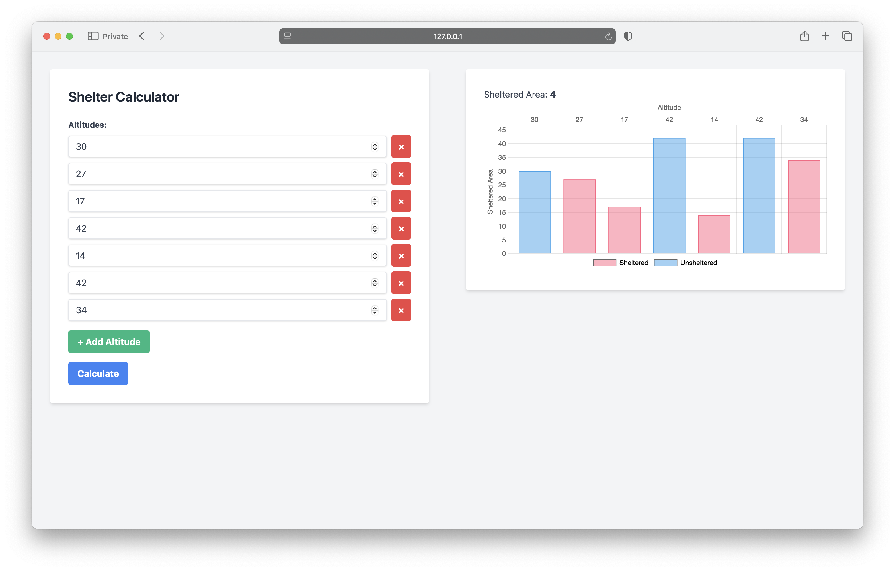

# Prolosaure Shelter Calculator

This Laravel application calculates the sheltered area for the Prolosaure rescue problem.

## Installation

1.  Clone the repository: 

```bash 
git clone https://github.com/LargatSeif/prolosaures-shelter-finder.git
```
2.  Navigate to the project directory: 

```bash 
cd prolosaures-shelter-finder
```
3.  Install dependencies: 

```bash 
composer install
```
4.  Generate an application key: 

```bash 
php artisan key:generate
```

## Execution

### Via Artisan Command (CLI)

1.  Run the command:

    ```bash
    php artisan shelter:calculate "30 27 17 42 29 12 14 41 42 42"
    ```

    or

    ```bash
    php artisan shelter:calculate
    ```

    (and enter the altitudes when prompted).

### Via Web Interface



1.  Serve the application using Laravel's built-in server or a web server like Apache or Nginx:

```bash
 php artisan serve
```

2.  Open your web browser and navigate to the [address](http://localhost:8000) shown by the previous command.

3.  Enter the altitudes one by one and click "Calculate".

4.  The result will be displayed on the right panel of the page with a graphical representation of the altitudes and the sheltered area.

## Testing
To run the tests, use the following command:
```bash
php artisan test
```
The tests cover the core logic of the shelter calculator.

## Design Choices

-   The core logic is encapsulated in the `App\Services\ShelterCalculator` class.
-   Input validation is performed in both the Artisan command and the web controller to ensure the altitudes are within the specified constraints.
-   The web interface uses a simple Blade view to display the form and the result.

## Notes

-   This implementation prioritizes clarity and simplicity.
-   For very large datasets, performance could be improved with more advanced algorithms, but for the problem constraints, the current approach is sufficient. 
